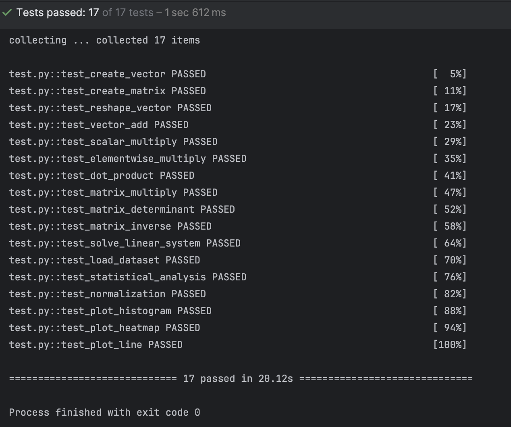
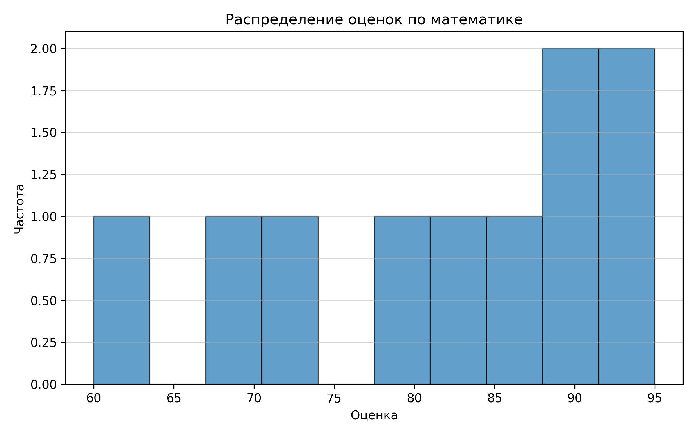
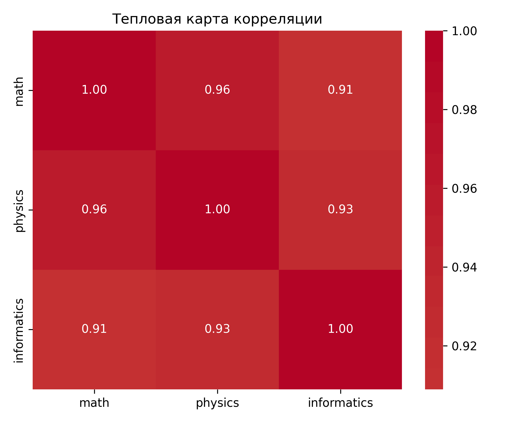
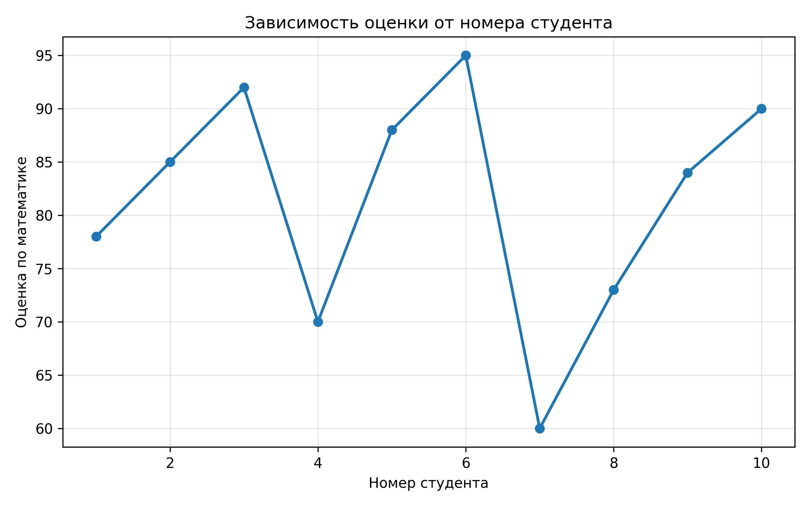

# Лабораторная работа №2
## Тема: Основы NumPy: массивы и векторные операции


##  Цель работы

- Освоить базовые операции с массивами NumPy
- Научиться выполнять векторные и матричные вычисления без циклов
- Реализовать статистический анализ данных
- Построить визуализации с помощью Matplotlib и Seaborn
- Покрыть код тестами и документацией согласно стандартам **DAST** (Tests, Annotations, Documentation, Specification)

## Задание

Реализовать 15 функций для:

1. **Создания массивов**: `create_vector()`, `create_matrix()`, `reshape_vector()`, `transpose_matrix()`
2. **Векторных операций**: сложение, умножение на скаляр, поэлементное умножение, скалярное произведение
3. **Матричных операций**: умножение, определитель, обратная матрица, решение СЛАУ
4. **Статистического анализа**: среднее, медиана, отклонение, перцентили, нормализация
5. **Визуализации**: гистограмма, тепловая карта, линейный график

## Реализация функций
### Блок 1: Создание массивов
```python
import numpy as np

def create_vector(n: int) -> np.ndarray:
    """
    Создать одномерный массив из чисел от 0 до n-1.

    Args:
        n: Длина вектора

    Returns:
        Одномерный массив NumPy shape (n,)

    Example:
        >>> create_vector(5)
        array([0, 1, 2, 3, 4])
    """
    return np.arange(n)
def create_matrix(rows: int, cols: int) -> np.ndarray:
    """
    Создать матрицу со случайными числами из равномерного распределения [0, 1).

    Args:
        rows: Количество строк
        cols: Количество столбцов

    Returns:
        Массив NumPy shape (rows, cols)
    """
    return np.random.rand(rows, cols)
def reshape_vector(vec: np.ndarray, new_shape: tuple[int, int]) -> np.ndarray:
    """
    Изменить форму вектора без изменения данных.

    Args:
        vec: Исходный одномерный массив
        new_shape: Кортеж (строки, столбцы) новой формы

    Returns:
        Массив новой формы

    Raises:
        ValueError: Если произведение new_shape не равно len(vec)
    """
    return vec.reshape(new_shape)
def transpose_matrix(matrix: np.ndarray) -> np.ndarray:
    """
    Транспонировать матрицу (строки ↔ столбцы).

    Args:
        matrix: Исходная матрица

    Returns:
        Транспонированная матрица
    """
    return matrix.T
   ```
    
### Блок 2: Векторные операции
```python
import numpy as np
def vector_add(a: np.ndarray, b: np.ndarray) -> np.ndarray:
    """
    Поэлементное сложение двух векторов.

    Args:
        a: Первый вектор
        b: Второй вектор

    Returns:
        Вектор суммы

    Raises:
        ValueError: Если векторы разной длины
    """
    if a.shape != b.shape:
        raise ValueError(f"Векторы должны иметь одинаковую форму: {a.shape} != {b.shape}")
    return a + b


def scalar_multiply(vec: np.ndarray, scalar: float) -> np.ndarray:
    """
    Умножить вектор на скаляр.

    Args:
        vec: Исходный вектор
        scalar: Число-множитель

    Returns:
        Вектор после умножения
    """
    return vec * scalar


def elementwise_multiply(a: np.ndarray, b: np.ndarray) -> np.ndarray:
    """
    Поэлементное умножение (произведение Адамара).

    Args:
        a: Первый вектор
        b: Второй вектор

    Returns:
        Вектор поэлементных произведений
    """
    return a * b


def dot_product(a: np.ndarray, b: np.ndarray) -> float:
    """
    Вычислить скалярное произведение двух векторов.

    Args:
        a: Первый вектор
        b: Второй вектор

    Returns:
        Скалярное произведение (число)
    """
    return float(np.dot(a, b))
```
### Блок 3: Матричные операции
```python
import numpy as np
def matrix_multiply(A: np.ndarray, B: np.ndarray) -> np.ndarray:
    """
    Матричное умножение (не поэлементное!).

    Args:
        A: Матрица размера (m, n)
        B: Матрица размера (n, p)

    Returns:
        Произведение матриц размера (m, p)

    Raises:
        ValueError: Если размеры несовместимы
    """
    if A.shape[1] != B.shape[0]:
        raise ValueError(f"Несовместимые размеры: {A.shape} и {B.shape}")
    return A @ B


def determinant(matrix: np.ndarray) -> float:
    """
    Вычислить определитель квадратной матрицы.

    Args:
        matrix: Квадратная матрица

    Returns:
        Определитель (число)

    Raises:
        ValueError: Если матрица не квадратная
    """
    if matrix.ndim != 2 or matrix.shape[0] != matrix.shape[1]:
        raise ValueError("Матрица должна быть квадратной")
    return float(np.linalg.det(matrix))


def inverse_matrix(matrix: np.ndarray) -> np.ndarray:
    """
    Вычислить обратную матрицу.

    Args:
        matrix: Квадратная невырожденная матрица

    Returns:
        Обратная матрица

    Raises:
        np.linalg.LinAlgError: Если матрица вырождена
    """
    return np.linalg.inv(matrix)


def solve_linear_system(A: np.ndarray, b: np.ndarray) -> np.ndarray:
    """
    Решить систему линейных уравнений Ax = b.

    Args:
        A: Матрица коэффициентов (n, n)
        b: Вектор свободных членов (n,)

    Returns:
        Вектор решения x

    Raises:
        np.linalg.LinAlgError: Если система не имеет единственного решения
    """
    return np.linalg.solve(A, b)
```
### Блок 4: Статистический анализ
```python
import numpy as np
def compute_mean(data: np.ndarray) -> float:
    """Вычислить среднее арифметическое."""
    return float(np.mean(data))


def compute_median(data: np.ndarray) -> float:
    """Вычислить медиану."""
    return float(np.median(data))


def compute_std(data: np.ndarray) -> float:
    """Вычислить стандартное отклонение (по генеральной совокупности)."""
    return float(np.std(data))


def normalize_data(data: np.ndarray) -> np.ndarray:
    """
    Нормализовать данные методом Min-Max к диапазону [0, 1].

    Формула: (x - min) / (max - min)

    Args:
        data: Исходный массив

    Returns:
        Нормализованный массив

    Note:
        Если все значения одинаковы, возвращается массив нулей.
    """
    min_val = np.min(data)
    max_val = np.max(data)
    
    if np.isclose(min_val, max_val):
        return np.zeros_like(data, dtype=float)
    
    return (data - min_val) / (max_val - min_val)
```
### Блок 5: Визуализация
```python
import matplotlib.pyplot as plt
import seaborn as sns
import pandas as pd
import numpy as np

def plot_histogram(data: np.ndarray, bins: int = 10, 
                   title: str = "Гистограмма", 
                   save_path: str | None = None) -> None:
    """
    Построить гистограмму распределения данных.

    Args:
        data: Массив данных
        bins: Количество интервалов
        title: Заголовок графика
        save_path: Путь для сохранения (опционально)
    """
    plt.figure(figsize=(8, 5))
    plt.hist(data, bins=bins, edgecolor='black', alpha=0.7)
    plt.title(title)
    plt.xlabel("Значение")
    plt.ylabel("Частота")
    plt.grid(axis='y', alpha=0.3)
    
    if save_path:
        plt.savefig(save_path, dpi=300, bbox_inches='tight')
    plt.close()


def plot_heatmap(data: pd.DataFrame, 
                 title: str = "Тепловая карта корреляции",
                 save_path: str | None = None) -> None:
    """
    Построить тепловую карту корреляционной матрицы.

    Args:
        data: DataFrame с числовыми колонками
        title: Заголовок графика
        save_path: Путь для сохранения (опционально)
    """
    corr = data.corr()
    plt.figure(figsize=(8, 6))
    sns.heatmap(corr, annot=True, fmt=".2f", cmap="coolwarm", center=0)
    plt.title(title)
    
    if save_path:
        plt.savefig(save_path, dpi=300, bbox_inches='tight')
    plt.close()


def plot_line(x: np.ndarray, y: np.ndarray, 
              label: str = "Данные",
              title: str = "Линейный график",
              save_path: str | None = None) -> None:
    """
    Построить линейный график.

    Args:
        x: Значения по оси X
        y: Значения по оси Y
        label: Подпись линии в легенде
        title: Заголовок графика
        save_path: Путь для сохранения (опционально)
    """
    plt.figure(figsize=(8, 5))
    plt.plot(x, y, marker='o', label=label, linewidth=2)
    plt.title(title)
    plt.xlabel("X")
    plt.ylabel("Y")
    plt.legend()
    plt.grid(alpha=0.3)
    
    if save_path:
        plt.savefig(save_path, dpi=300, bbox_inches='tight')
    plt.close()
```
### Тестирование
 

## Визуализация

### Гистограмма оценок по математике


### Тепловая карта корреляции предметов
 

### График: студент → оценка

### Нюансы и особенности решения
1. **Векторизация вместо циклов**  
   Все операции реализованы через встроенные функции NumPy, что обеспечивает скорость в 10-100 раз выше, чем при использовании циклов Python.

2. **Обработка граничных случаев**  
   - В `normalize_data()` добавлена проверка на одинаковые значения (избегаем деления на ноль)
   - В `inverse_matrix()` и `solve_linear_system()` используем `try-except` для обработки вырожденных матриц

3. **Аннотации типов**  
   Все функции имеют аннотации согласно PEP-484, что улучшает читаемость и позволяет использовать статические анализаторы (mypy).

4. **Документация**  
   Докстринги в формате Google-style (PEP-257) позволяют генерировать автоматическую документацию и использовать `help()` в интерактивном режиме.

5. **Сохранение графиков**  
   Функции визуализации принимают параметр `save_path` и вызывают `plt.close()` для предотвращения утечек памяти.

### **Выводы**

В ходе работы я:
1) Освоила создание и манипуляцию массивами NumPy
2) Научилась выполнять векторные и матричные операции
3) Реализовала статистический анализ
4) Построила визуализации
5) Покрыла функции тестами
