# Лабораторная работа №3
## Тема: Очистка и трансформация данных с использованием pandas (Titanic)

!!! info "Метаданные"
    - **Студент**: Саляхова Камила
    - **Группа**: P3123
    - **Датасет**: [Titanic (Kaggle)](https://www.kaggle.com/c/titanic/data)
    - **Colab**: [Мой  код](https://colab.research.google.com/drive/1Qm9_S4vLFz8Ofy83t7xLWXaWjiv7W3TG?usp=sharing)

---

##  Цель работы

Освоение методов очистки и трансформации данных с использованием библиотеки `pandas` на примере реальных данных из Kaggle.

### Задачи:
- Провести первичный анализ данных
- Обработать пропуски разными методами
- Создать новые признаки (feature engineering)
- Обнаружить и обработать выбросы
- Выполнить агрегацию и визуализацию
- Оценить качество очистки через метрики

---

## Описание набора данных

| Признак | Описание | Тип | Пропуски |
|---------|----------|-----|----------|
| `PassengerId` | Уникальный идентификатор | int | 0 |
| `Survived` | Выжил (1) / Не выжил (0) | int | 0 |
| `Pclass` | Класс билета (1, 2, 3) | int | 0 |
| `Name` | Полное имя | str | 0 |
| `Sex` | Пол | str | 0 |
| `Age` | Возраст | float | ~20% |
| `SibSp` | Братья/сёстры/супруги на борту | int | 0 |
| `Parch` | Родители/дети на борту | int | 0 |
| `Ticket` | Номер билета | str | 0 |
| `Fare` | Стоимость билета | float | 0 |
| `Cabin` | Номер каюты | str | ~77% |
| `Embarked` | Порт посадки (C, Q, S) | str | ~0.2% |

---

## Первичный анализ

### Статистика датафрейма
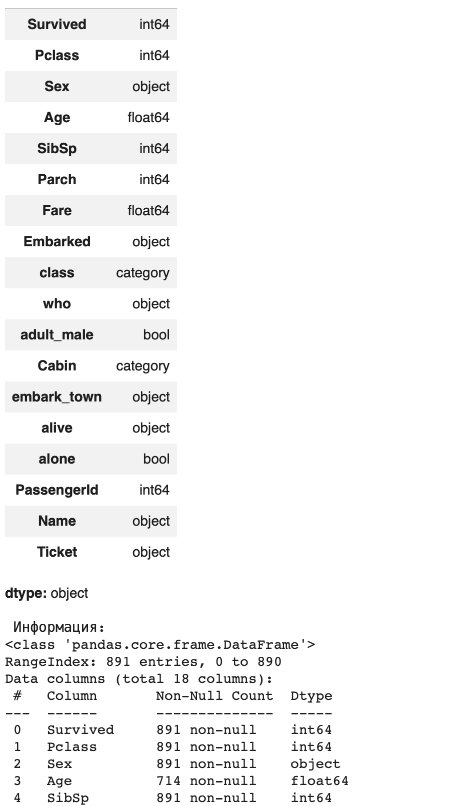


### Визуализация пропусков
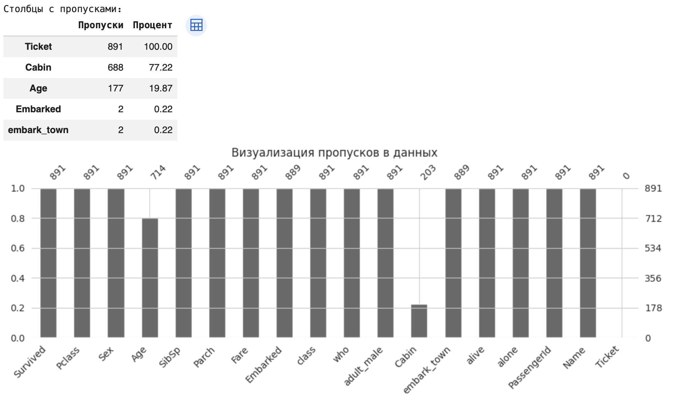
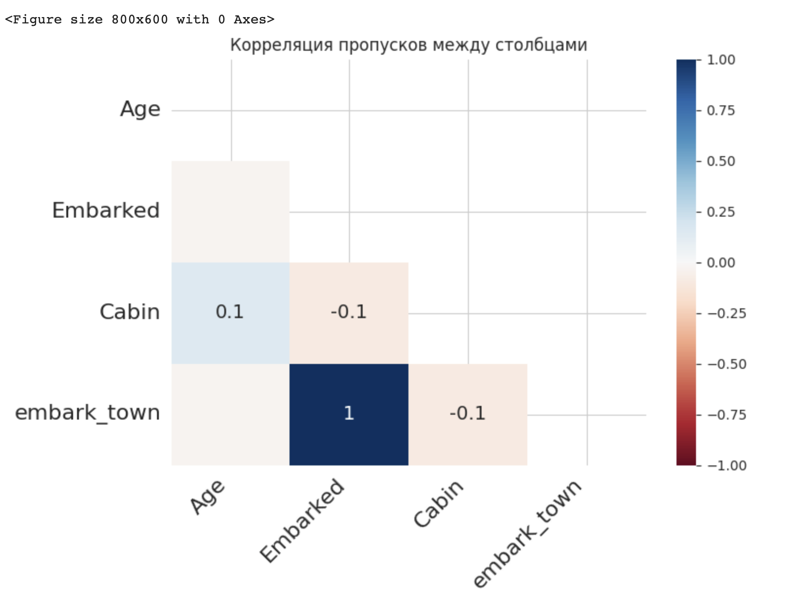

**Вывод:** Наибольшее количество пропусков в столбце `Cabin` (77%), что делает его малопригодным для прямого использования. Столбец `Age` имеет 20% пропусков — требует заполнения.

---

##  Обработка пропусков

### Методы заполнения:

| Столбец | Метод | Обоснование |
|---------|-------|-------------|
| `Age` | Медиана | Устойчива к выбросам, сохраняет распределение |
| `Embarked` | Мода | Наиболее частое значение — логичная замена |
| `Cabin` | Извлечение палубы (первая буква) | Сохраняет информацию о расположении каюты |

### Результаты:
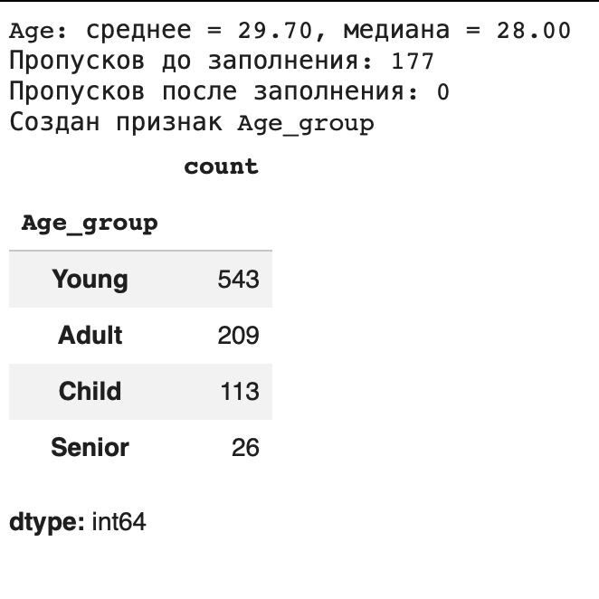


---

## Трансформация данных

### Созданные признаки:

| Признак | Описание | Пример значений |
|---------|----------|----------------|
| `Age_group` | Возрастная категория | Child, Young, Adult, Senior |
| `Title` | Титул из имени | Mr, Mrs, Miss, Master, Other |
| `FamilySize` | Размер семьи | 1–11 |
| `IsAlone` | Одинокий пассажир | 0 / 1 |
| `Pclass_str` | Класс билета (текст) | F, S, T |
| `Sex_numeric` | Пол (число) | 0 (male), 1 (female) |
| `Deck` | Палуба из номера каюты | A–G, T, Unknown |

### Преобразования типов:
- `Pclass`: int → category (F/S/T)
- `Sex`: str → int (0/1)
- Новые признаки: созданы через `.apply()` и векторизованные операции

---

##  Обработка выбросов

### Выявленные выбросы:
- **Fare**: 49 значений (5.5%) выше 95-го перцентиля ($107)
- **Age**: 28 значений (3.1%) выше 95-го перцентиля (62 года)

### Метод обработки: Winsorization
```python
df['Fare'] = df['Fare'].clip(upper=df['Fare'].quantile(0.95))
```
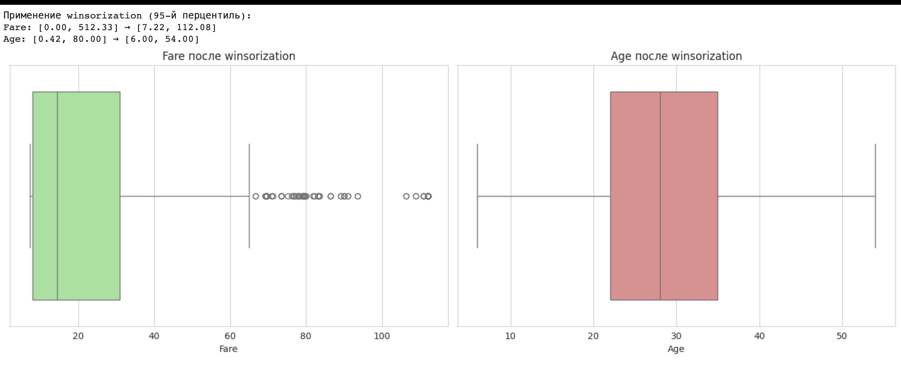
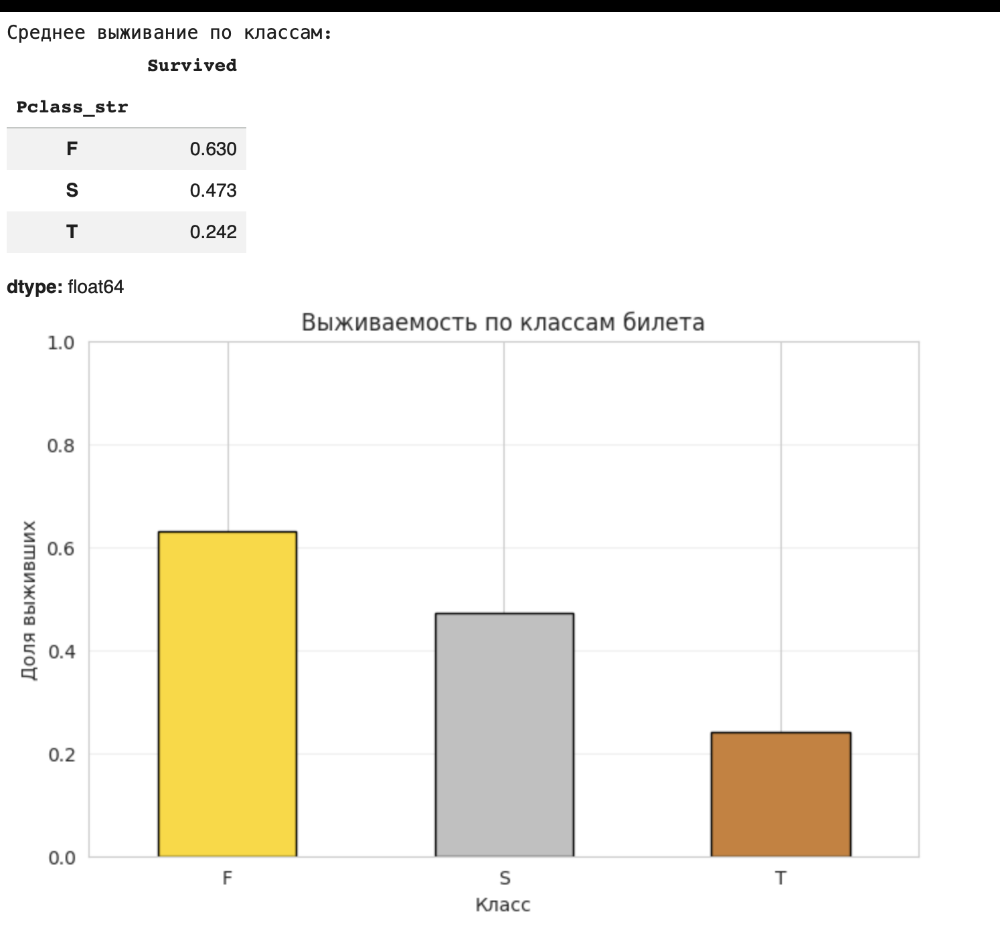
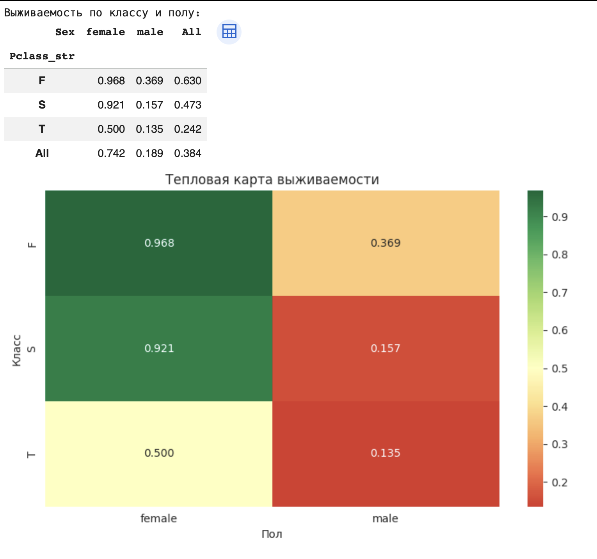
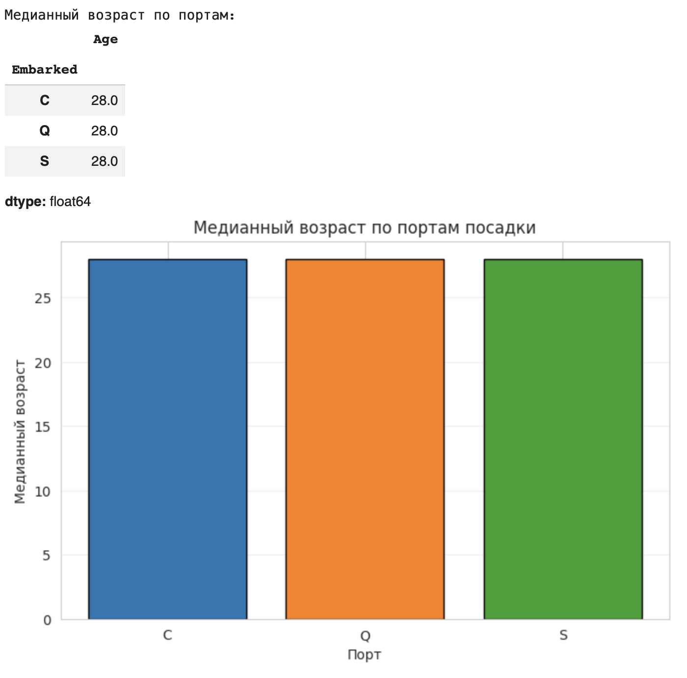
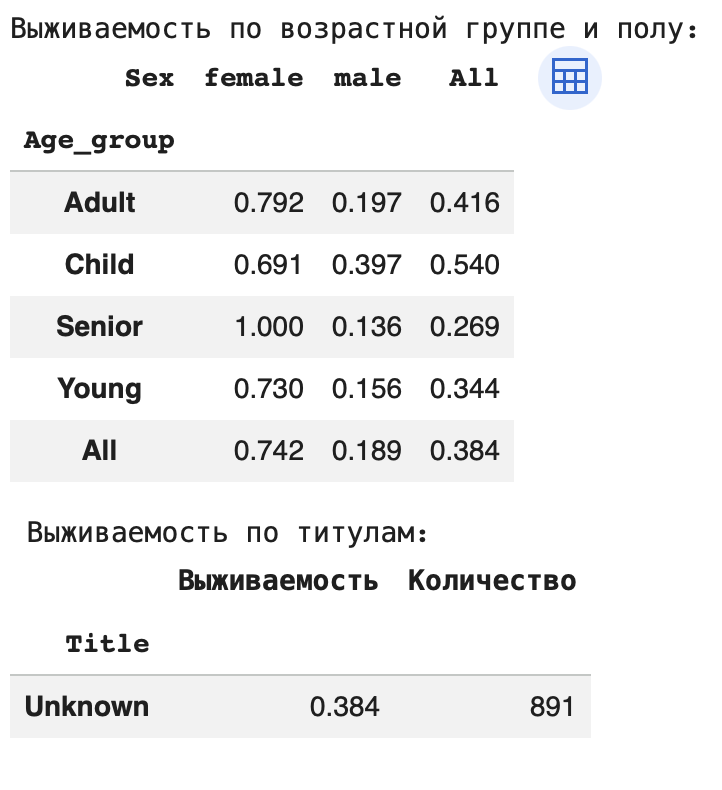
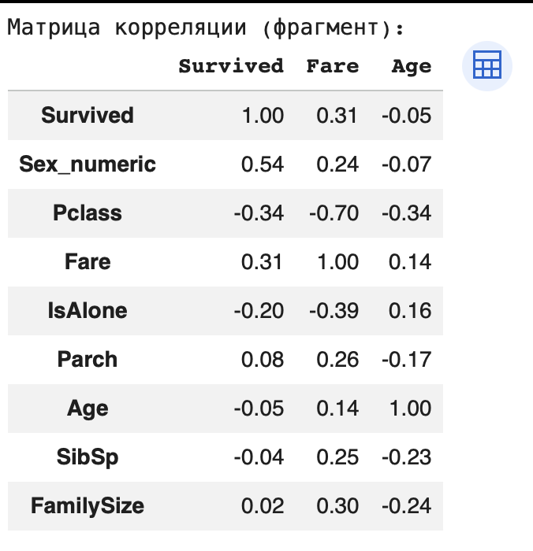
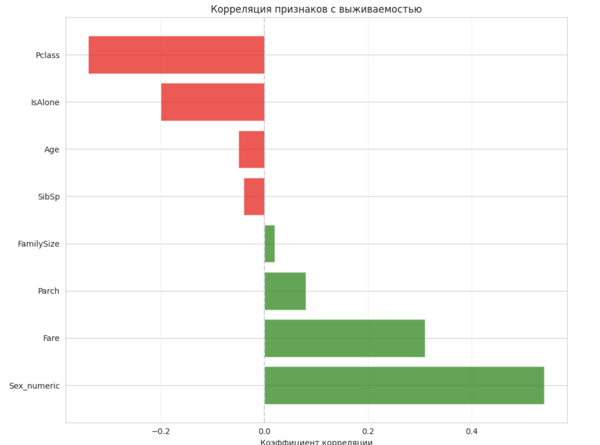
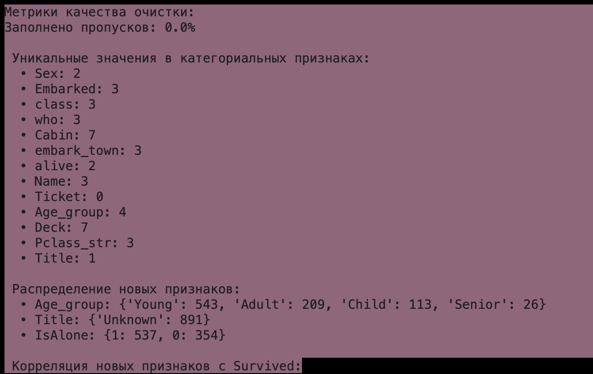
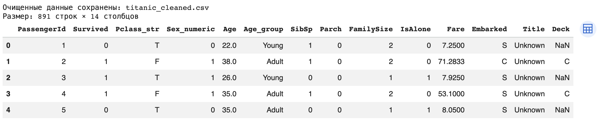